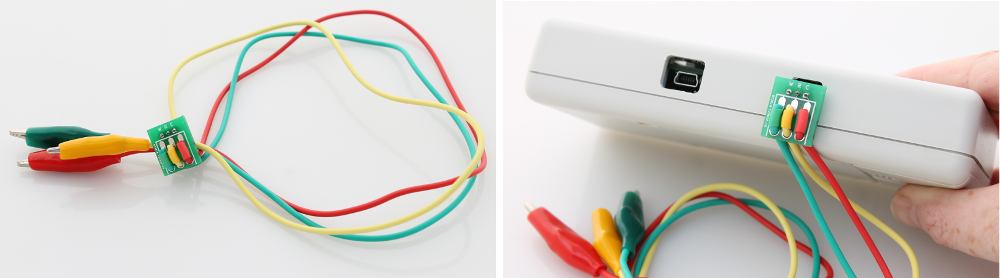
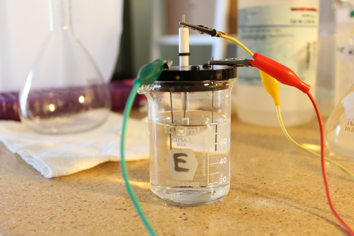
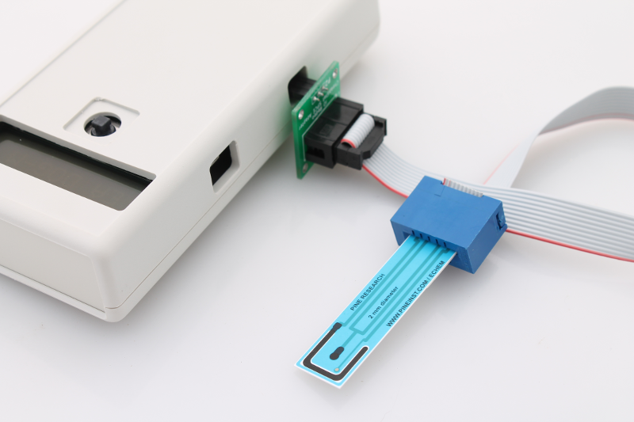
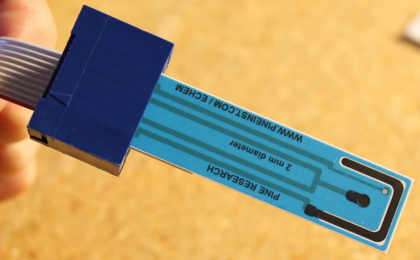

.. _electrodes_label:

Connecting electrodes to the CheapStat device
=====================================================
Each CheapStat unit ships with an electrode adapter. This is a small PCB with a set of 3 colored wires with alligator clips for connecting to your electrodes. Insert the 3-pin connector into the side of the CheapStat as shown in the image below. Note the orientation. The leads should be hanging down off the side. 

Next, attach the clips to the reference, working and counter electrodes as follows:

*  Green alligator clip -- Working electrode 
*  Yellow alligator clip -- Reference electrode
*  Red alligator clip -- Counter electrode

In the experimental set-up shown below, a Ag/AgCl reference electrode [#f1]_ was used along with carbon lead pencil for the counter and working electrodes. 

  
   
   
Adapters for screen printed electrodes
-------------------------------------------------------------

Small PCB adapter boards with a card edge connector can be used for connecting screen printed electrodes to the CheapStat. Currently there are two versions available:

* `Adapter ver A <http://www.iorodeo.com/content/cheapstat-screen-printed-electrode-adapter-pcb>`_ - Includes a 5x2 card edge connector for cards with 5 pins e.g. Pine Research Instrumentation cards [#f2]_. 
* Adapter ver B - Includes a 3x2 card edge connector for cards with 3 pins e.g. DropSense cards [#f3]_.

Adapter ver A with Pine Instruments SPE
^^^^^^^^^^^^^^^^^^^^^^^^^^^^^^^^^^^^^^^^^^^^^^^

Insert a card into the adapter. Plug the adapter PCB into the side of the CheapStat as shown in the images below:

   
Adapter ver B with DropSens SPE
^^^^^^^^^^^^^^^^^^^^^^^^^^^^^^^^^^^^^^^^^^^^^^^
Coming soon .....

.. rubric:: Footnotes

.. [#f1] CH Instruments Inc. (http://www.chinstruments.com/). Part # CHI111 T. $28 + shipping.
.. [#f2] Pine Research Instrumentation (https://pineinst.com/echem/). Part # RRPE1001C-10. 10-pack of electrodes, $30 + shipping.
.. [#f3] DropSens (http://www.dropsens.com/). Part # 110-75. 75-pack of electrodes, $224 + shipping.

