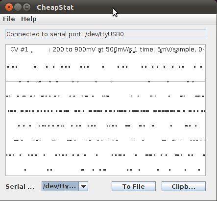
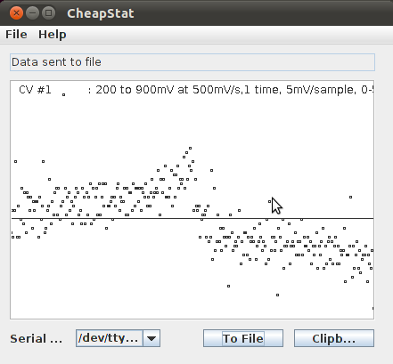
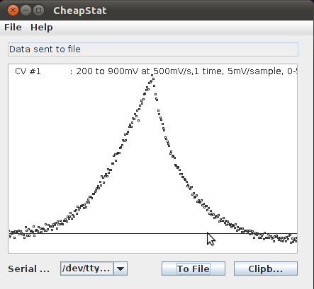

.. _measurements_label:

Viewing and saving data in the CheapStat GUI
================================================

* Download the CheapStat software from here: http://web.chem.ucsb.edu/~kwp/cheapstat/
* Requires Java which you can download from here: https://www.java.com/en/
* Launch the CheapStat GUI by double-clicking on the CheapStat_111810.jar file in the 'gui' subfolder. 
* Select the device from the drop-down menu
* Start a measurement as described in the  :ref:`quickstart_label` section.
* Save data by clicking on "To File" 

Below are some examples of cyclic voltammetry data. 

No electrodes connected
--------------------------------------------------------------

Background CV measurement (0.1M KCl)
-------------------------------------------

Experimental CV measurement (orange juice)
---------------------------------------------

   
